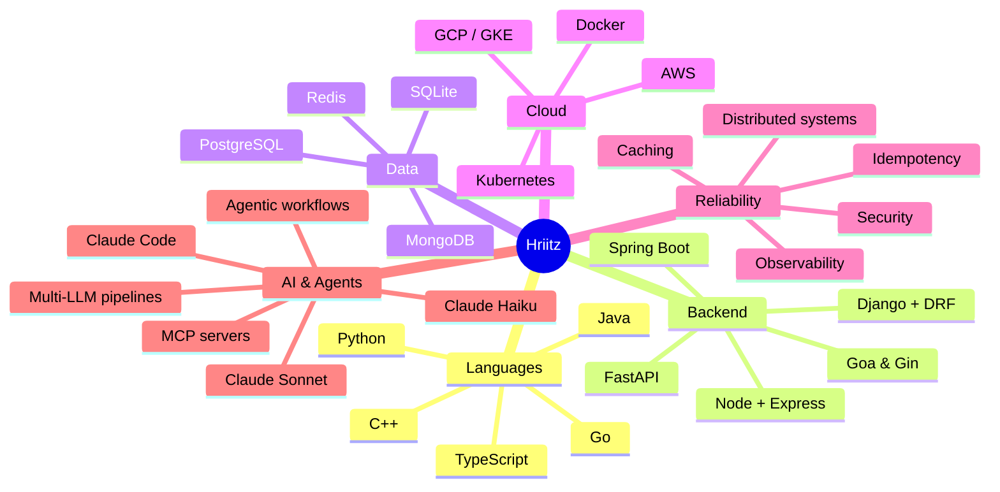
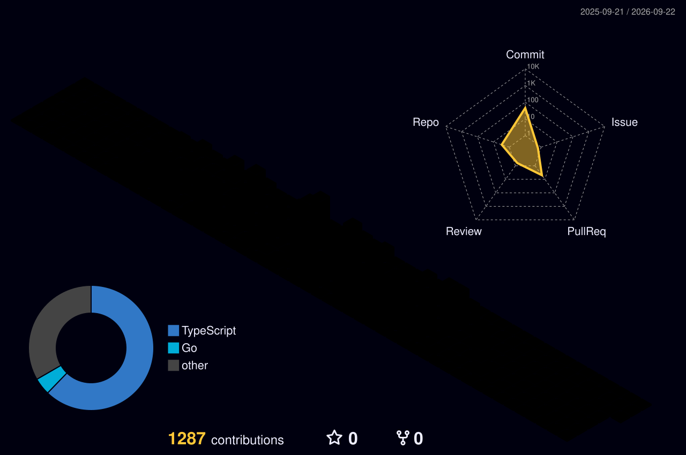

<!-- ━━━━━━━━━━━━━━━━━━━━━━━━━━━━━━━━━━━━━━━━━━━━━━━━━━━━━━━━━━━━━━━━━━━━━━ -->
<!--                              HEADER BANNER                               -->
<!-- ━━━━━━━━━━━━━━━━━━━━━━━━━━━━━━━━━━━━━━━━━━━━━━━━━━━━━━━━━━━━━━━━━━━━━━ -->


<!-- ━━━━━━━━━━━━━━━━━━━━━━━━━━━━━━━━━━━━━━━━━━━━━━━━━━━━━━━━━━━━━━━━━━━━━━ -->
<!--                            TYPING ANIMATION                              -->
<!-- ━━━━━━━━━━━━━━━━━━━━━━━━━━━━━━━━━━━━━━━━━━━━━━━━━━━━━━━━━━━━━━━━━━━━━━ -->

<div align="center">

[](https://hritik-singh-portfolio.vercel.app/)

</div>

<!-- ━━━━━━━━━━━━━━━━━━━━━━━━━━━━━━━━━━━━━━━━━━━━━━━━━━━━━━━━━━━━━━━━━━━━━━ -->
<!--                              SOCIAL BADGES                               -->
<!-- ━━━━━━━━━━━━━━━━━━━━━━━━━━━━━━━━━━━━━━━━━━━━━━━━━━━━━━━━━━━━━━━━━━━━━━ -->

<div align="center">

<a href="https://hritik-singh-portfolio.vercel.app/"></a>
<a href="https://linkedin.com/in/hriitz"></a>
<a href="https://twitter.com/hriitz_"></a>
<a href="mailto:hritik3447@gmail.com"></a>

</div>

<br/>

<!-- ━━━━━━━━━━━━━━━━━━━━━━━━━━━━━━━━━━━━━━━━━━━━━━━━━━━━━━━━━━━━━━━━━━━━━━ -->
<!--                                  ABOUT                                   -->
<!-- ━━━━━━━━━━━━━━━━━━━━━━━━━━━━━━━━━━━━━━━━━━━━━━━━━━━━━━━━━━━━━━━━━━━━━━ -->

## About

Backend / platform engineer based in India. I build FinTech systems from 0 → 1 and run them at scale on GCP / GKE. Mostly Go and Python, sometimes TypeScript. The work I find interesting tends to live where distributed systems meet money — payments, idempotent webhooks, real-time streams, and the observability that keeps all of it honest. Bonus points if it reconciles down to the paisa.

Lately I've been spending a lot of time on agentic coding. Claude Code is my daily driver, and I run multi-LLM pipelines in production — Haiku for cheap enrichment, Sonnet for reasoning. Globradar is where most of that work is happening right now.

Outside the day job, I'm building **Njord** — because every fintech engineer eventually builds their own personal-finance app — and **Globradar**, because Bloomberg-grade market alerts without the Bloomberg bill seemed worth a shot.

I tend to optimize for:

- APIs that are easy to reason about and hard to break
- Idempotency and graceful degradation over heroic retries
- Observability you regret not having — usually right around 2 AM
- AI tooling as leverage, not magic

---

<!-- ━━━━━━━━━━━━━━━━━━━━━━━━━━━━━━━━━━━━━━━━━━━━━━━━━━━━━━━━━━━━━━━━━━━━━━ -->
<!--                              WHAT I WORK ON                              -->
<!-- ━━━━━━━━━━━━━━━━━━━━━━━━━━━━━━━━━━━━━━━━━━━━━━━━━━━━━━━━━━━━━━━━━━━━━━ -->

## What I work on

<table>
<tr>
<td valign="top" width="50%">

### FinTech & payments infrastructure
Backend systems for financial workflows — idempotent webhooks, exactly-once processing, encrypted token orchestration, automated reconciliation, and structured failure handling.

`Go` · `Goa` · `PostgreSQL` · `Redis` · `KYC` · `OAuth`

</td>
<td valign="top" width="50%">

### Production REST + real-time backends
Design-first APIs with comprehensive error states, observability built in, sub-500ms p99, and graceful degradation. WebSocket-driven state propagation when latency matters.

`Go` · `Gin` · `FastAPI` · `WebSocket` · `Redis` · `JWT` · `RBAC`

</td>
</tr>
<tr>
<td valign="top" width="50%">

### Cloud-native ops & compliance
Multi-environment GKE, zero-touch CI/CD with GitHub Actions, Prometheus + Grafana, structured logging, OWASP / CERT-In hardening, and encryption at rest.

`GCP` · `GKE` · `Docker` · `Prometheus` · `Grafana` · `OAuth2` · `RBAC`

</td>
<td valign="top" width="50%">

### Agentic coding & multi-LLM systems
Claude Code with repo-scoped `CLAUDE.md` and `.claudeignore` as a daily workflow. Multi-LLM pipelines in production — cheap-tier enrichment + premium-tier reasoning. MCP servers, automated review gates, governance.

`Claude Code` · `Claude Haiku/Sonnet` · `Cursor` · `OpenAI Codex` · `MCP`

</td>
</tr>
</table>

---

<!-- ━━━━━━━━━━━━━━━━━━━━━━━━━━━━━━━━━━━━━━━━━━━━━━━━━━━━━━━━━━━━━━━━━━━━━━ -->
<!--                                 PROJECTS                                 -->
<!-- ━━━━━━━━━━━━━━━━━━━━━━━━━━━━━━━━━━━━━━━━━━━━━━━━━━━━━━━━━━━━━━━━━━━━━━ -->

## Projects

<table>
<tr>
<td width="50%" valign="top">

### Njord
Personal finance dashboard for India — web SPA + Telegram bot, single-user, owner-gated.

A Go backend with the React/Vite frontend embedded into the binary. CRED-inspired "Obsidian Depth" UI on shadcn/ui + Tailwind. Hexagonal architecture with a pluggable `BankParser` interface — Axis + SBI today; new bank = new file, no edits to existing code. SHA-256-keyed idempotent imports — same CSV or forwarded SMS is a no-op. SQLite + FTS5 for full-text chat search. Cron-driven weekly digests, REST API for the dashboard, Telegram bot adapter, and an integrated Claude chat surface.

`Go 1.22` · `React + Vite` · `shadcn/ui` · `Tailwind` · `SQLite + FTS5` · `Telegram` · `Claude`

</td>
<td width="50%" valign="top">

### Globradar
AI-powered market intelligence — detects market-moving events across 9 data sources (Yahoo, EDGAR, GDELT, NewsAPI×3, Massive, FRED, Reddit) and generates trading signals for Indian (NSE/BSE) and US markets.

Two-tier Claude pipeline — Haiku for high-volume event enrichment, Sonnet for reasoning over signal candidates. Async collection via APScheduler, dedup, XGBoost predictor, FinBERT + spaCy NLP fallbacks, Telegram alerts. FastAPI API + Streamlit dashboard. 111 pytest tests, ruff + pyright, `uv`-managed deps. Currently shipping Phase 4 (Signal Engine) of a 7-phase roadmap.

`Python 3.11` · `Claude Haiku + Sonnet` · `XGBoost` · `FinBERT` · `FastAPI` · `Streamlit` · `APScheduler` · `SQLite` · `uv`

</td>
</tr>
<tr>
<td width="50%" valign="top">

### Smart India Hackathon 2022 — Grand Finalist
AI-driven pronunciation correction system built for the Ministry of Defence problem statement.

`Python` · `Speech Processing` · `Deep Learning`

</td>
<td width="50%" valign="top">

### Personal Portfolio
Modern dev portfolio — Next.js 14 + React 18 + TypeScript with Framer Motion transitions, next-themes dark mode, and Resend for the contact form. Vercel Analytics + Speed Insights. Live at [hritik-singh-portfolio.vercel.app](https://hritik-singh-portfolio.vercel.app/).

`Next.js 14` · `TypeScript` · `Tailwind` · `Framer Motion` · `Resend` · `Vercel`

</td>
</tr>
</table>

---

<!-- ━━━━━━━━━━━━━━━━━━━━━━━━━━━━━━━━━━━━━━━━━━━━━━━━━━━━━━━━━━━━━━━━━━━━━━ -->
<!--                                  STACK                                   -->
<!-- ━━━━━━━━━━━━━━━━━━━━━━━━━━━━━━━━━━━━━━━━━━━━━━━━━━━━━━━━━━━━━━━━━━━━━━ -->

## Stack

<table>
<tr>
<td valign="middle"><strong>Languages</strong></td>
<td><a href="https://skillicons.dev"></a></td>
</tr>
<tr>
<td valign="middle"><strong>Backend</strong></td>
<td><a href="https://skillicons.dev"></a></td>
</tr>
<tr>
<td valign="middle"><strong>Frontend</strong></td>
<td><a href="https://skillicons.dev"></a></td>
</tr>
<tr>
<td valign="middle"><strong>Data</strong></td>
<td><a href="https://skillicons.dev"></a></td>
</tr>
<tr>
<td valign="middle"><strong>Cloud / DevOps</strong></td>
<td><a href="https://skillicons.dev"></a></td>
</tr>
<tr>
<td valign="middle"><strong>Tools</strong></td>
<td><a href="https://skillicons.dev"></a></td>
</tr>
</table>

---

<!-- ━━━━━━━━━━━━━━━━━━━━━━━━━━━━━━━━━━━━━━━━━━━━━━━━━━━━━━━━━━━━━━━━━━━━━━ -->
<!--                                 SKILLS MAP                               -->
<!-- ━━━━━━━━━━━━━━━━━━━━━━━━━━━━━━━━━━━━━━━━━━━━━━━━━━━━━━━━━━━━━━━━━━━━━━ -->

## Skills



---

<!-- ━━━━━━━━━━━━━━━━━━━━━━━━━━━━━━━━━━━━━━━━━━━━━━━━━━━━━━━━━━━━━━━━━━━━━━ -->
<!--                                  GITHUB                                  -->
<!-- ━━━━━━━━━━━━━━━━━━━━━━━━━━━━━━━━━━━━━━━━━━━━━━━━━━━━━━━━━━━━━━━━━━━━━━ -->

## GitHub

<div align="center">
  
</div>

<div align="center">
  
  
</div>

<div align="center">
  
  
</div>

### Streak

<div align="center">
  
</div>

### Activity

<div align="center">
  
</div>

### Contributions (3D)

<div align="center">
  
</div>

### Contribution snake

<picture>
  <source media="(prefers-color-scheme: dark)" srcset="https://raw.githubusercontent.com/Hriitz/Hriitz/output/github-snake-dark.svg"/>
  <source media="(prefers-color-scheme: light)" srcset="https://raw.githubusercontent.com/Hriitz/Hriitz/output/github-snake.svg"/>
  
</picture>

---

<!-- ━━━━━━━━━━━━━━━━━━━━━━━━━━━━━━━━━━━━━━━━━━━━━━━━━━━━━━━━━━━━━━━━━━━━━━ -->
<!--                                 TROPHIES                                 -->
<!-- ━━━━━━━━━━━━━━━━━━━━━━━━━━━━━━━━━━━━━━━━━━━━━━━━━━━━━━━━━━━━━━━━━━━━━━ -->

## Trophies

<div align="center">
  <a href="https://github.com/ryo-ma/github-profile-trophy">
    
  </a>
</div>

---

<!-- ━━━━━━━━━━━━━━━━━━━━━━━━━━━━━━━━━━━━━━━━━━━━━━━━━━━━━━━━━━━━━━━━━━━━━━ -->
<!--                              THIS WEEK'S WORK                            -->
<!-- ━━━━━━━━━━━━━━━━━━━━━━━━━━━━━━━━━━━━━━━━━━━━━━━━━━━━━━━━━━━━━━━━━━━━━━ -->

## This week's coding

<!--START_SECTION:waka-->

```txt
From: 24 April 2026 - To: 01 May 2026

No activity tracked
```

<!--END_SECTION:waka-->

---

<!-- ━━━━━━━━━━━━━━━━━━━━━━━━━━━━━━━━━━━━━━━━━━━━━━━━━━━━━━━━━━━━━━━━━━━━━━ -->
<!--                                  QUOTE                                   -->
<!-- ━━━━━━━━━━━━━━━━━━━━━━━━━━━━━━━━━━━━━━━━━━━━━━━━━━━━━━━━━━━━━━━━━━━━━━ -->

<div align="center">
  
</div>

---

<!-- ━━━━━━━━━━━━━━━━━━━━━━━━━━━━━━━━━━━━━━━━━━━━━━━━━━━━━━━━━━━━━━━━━━━━━━ -->
<!--                              A FEW THINGS                                -->
<!-- ━━━━━━━━━━━━━━━━━━━━━━━━━━━━━━━━━━━━━━━━━━━━━━━━━━━━━━━━━━━━━━━━━━━━━━ -->

## A few things I've shipped

- API latency in production fintech: **2–3s → <500ms**
- Cache hit rate engineered: **70–85%**
- Production uptime achieved: **99.9%**
- Performance gain via DB tuning: **60–80%** faster
- Junior engineers mentored: **5+**
- Smart India Hackathon 2022: **Grand Finalist**

---

<!-- ━━━━━━━━━━━━━━━━━━━━━━━━━━━━━━━━━━━━━━━━━━━━━━━━━━━━━━━━━━━━━━━━━━━━━━ -->
<!--                                GET IN TOUCH                              -->
<!-- ━━━━━━━━━━━━━━━━━━━━━━━━━━━━━━━━━━━━━━━━━━━━━━━━━━━━━━━━━━━━━━━━━━━━━━ -->

## Get in touch

Open to collaboration in FinTech, payments infrastructure, 0 → 1 platform builds, and production reliability work.

<div align="center">

<a href="mailto:hritik3447@gmail.com"></a>
<a href="https://linkedin.com/in/hriitz"></a>
<a href="https://twitter.com/hriitz_"></a>
<a href="https://hritik-singh-portfolio.vercel.app/"></a>

</div>

---

<div align="center">
  
</div>

<!-- ━━━━━━━━━━━━━━━━━━━━━━━━━━━━━━━━━━━━━━━━━━━━━━━━━━━━━━━━━━━━━━━━━━━━━━ -->
<!--                                   FOOTER                                 -->
<!-- ━━━━━━━━━━━━━━━━━━━━━━━━━━━━━━━━━━━━━━━━━━━━━━━━━━━━━━━━━━━━━━━━━━━━━━ -->


