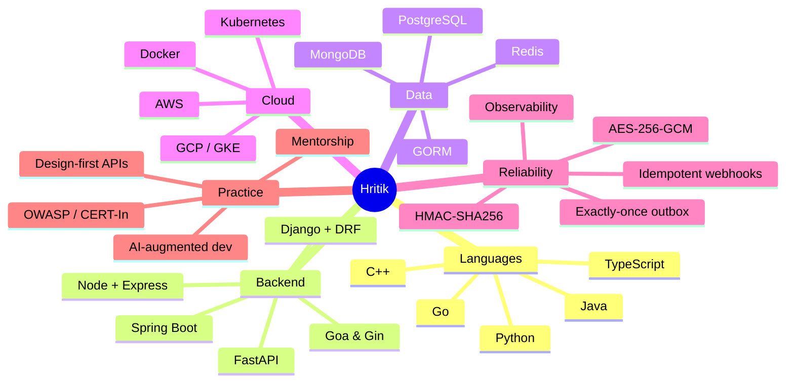

<!-- ━━━━━━━━━━━━━━━━━━━━━━━━━━━━━━━━━━━━━━━━━━━━━━━━━━━━━━━━━━━━━━━━━━━━━━ -->
<!--                       ANIMATED HEADER BANNER                            -->
<!-- ━━━━━━━━━━━━━━━━━━━━━━━━━━━━━━━━━━━━━━━━━━━━━━━━━━━━━━━━━━━━━━━━━━━━━━ -->


<!-- ━━━━━━━━━━━━━━━━━━━━━━━━━━━━━━━━━━━━━━━━━━━━━━━━━━━━━━━━━━━━━━━━━━━━━━ -->
<!--                            TYPING ANIMATION                              -->
<!-- ━━━━━━━━━━━━━━━━━━━━━━━━━━━━━━━━━━━━━━━━━━━━━━━━━━━━━━━━━━━━━━━━━━━━━━ -->

<div align="center">

[](https://hritik-singh-portfolio.vercel.app/)

</div>

<!-- ━━━━━━━━━━━━━━━━━━━━━━━━━━━━━━━━━━━━━━━━━━━━━━━━━━━━━━━━━━━━━━━━━━━━━━ -->
<!--                              SOCIAL BADGES                               -->
<!-- ━━━━━━━━━━━━━━━━━━━━━━━━━━━━━━━━━━━━━━━━━━━━━━━━━━━━━━━━━━━━━━━━━━━━━━ -->

<div align="center">

<a href="https://hritik-singh-portfolio.vercel.app/"></a>
<a href="https://linkedin.com/in/hriitz"></a>
<a href="https://twitter.com/hriitz_"></a>
<a href="mailto:hritik3447@gmail.com"></a>
<a href="https://springstreet.in"></a>

</div>

<br/>

<!-- ━━━━━━━━━━━━━━━━━━━━━━━━━━━━━━━━━━━━━━━━━━━━━━━━━━━━━━━━━━━━━━━━━━━━━━ -->
<!--                                ABOUT ME                                  -->
<!-- ━━━━━━━━━━━━━━━━━━━━━━━━━━━━━━━━━━━━━━━━━━━━━━━━━━━━━━━━━━━━━━━━━━━━━━ -->

## 👋 About Me

I'm a **Founding Engineer at [Spring Street](https://springstreet.in)** and a **Platform Engineer at Wright Research** — building production-grade FinTech systems from **0 → 1** and operating them at scale on GCP / GKE.

> 🚀 **Currently shipping** — exactly-once payment processing, idempotent webhook delivery (HMAC‑SHA256), and AES‑256‑GCM token orchestration for a regulated financial product.

**What I care about**

- 🧱 **Design-first APIs** that are easy to reason about and hard to break
- 🛡️ **Financial-grade reliability** — exactly-once outbox, idempotency keys, automated reconciliation
- ⚡ **Sub-second user experiences** through caching, query design, and graceful degradation
- 🔐 **Security & compliance** — CERT-In, OWASP, AES-256-GCM, RBAC
- 🤖 **Force-multiplier engineering** with AI tooling — Claude Code, Cursor, OpenAI Codex

---

<!-- ━━━━━━━━━━━━━━━━━━━━━━━━━━━━━━━━━━━━━━━━━━━━━━━━━━━━━━━━━━━━━━━━━━━━━━ -->
<!--                            FEATURED EXPERIENCE                           -->
<!-- ━━━━━━━━━━━━━━━━━━━━━━━━━━━━━━━━━━━━━━━━━━━━━━━━━━━━━━━━━━━━━━━━━━━━━━ -->

## 💼 Featured Experience

<details open>
<summary><strong>🌱 Spring Street — Founding Engineer</strong>&nbsp;·&nbsp;<em>Nov 2025 – Present · Remote</em></summary>
<br/>

- **0 → 1 ownership** — Architected and built the entire full-stack platform (React/TypeScript, Go, PostgreSQL) as the **sole founding engineer**; delivered the MVP and grew the team by hiring and onboarding engineers.
- **Backend at scale** — Designed a design-first backend with **100+ REST APIs**, real-time **WebSocket** streams, and **35+ relational tables**; integrated brokerage and KYC providers with **AES‑256‑GCM** encryption and secure token orchestration.
- **Financial-grade reliability** — Built **exactly-once processing** (outbox pattern), **idempotent webhook systems** (HMAC‑SHA256), Redis + in-memory caching with graceful degradation, and automated reconciliation + alerting for transaction failures.
- **Cloud & DevOps ownership** — Provisioned and operated **GKE clusters** (prod + staging) on GCP; implemented zero-touch CI/CD (GitHub Actions), observability (Prometheus + Grafana), and structured logging with retention policies.
- **Admin & operations tooling** — Built an internal dashboard with **20+ privileged APIs**, audit logs for all state changes, and tooling for API replay and manual state overrides to resolve production issues.
- **User lifecycle systems** — JWT + OAuth auth, multi-step KYC onboarding, multi-rail funding flows with **50+ mapped error states**, transactional comms, and a zero-downtime analytics migration.
- **AI-augmented engineering** — Standardized dev workflows using **Claude Code, Cursor, and OpenAI Codex**; introduced shared conventions, governance, and automated QA / review pipelines that cut PR cycle time.
- **Engineering foundation** — Authored architecture docs, API references, schema design, runbooks, and established a governance model prioritizing **security → correctness → simplicity** across the team.

<sub>**Stack:** `Go` · `Goa` · `PostgreSQL` · `GORM` · `React` · `TypeScript` · `JWT/OAuth` · `RBAC` · `GKE` · `Docker` · `Prometheus` · `Grafana`</sub>

</details>

<details>
<summary><strong>📈 Wright Research — Platform Engineer</strong>&nbsp;·&nbsp;<em>Dec 2023 – Present · Remote</em></summary>
<br/>

- Architected backend serving **25,000+ users** in a regulated financial product.
- Reduced API latency from **2–3s → <500ms** through query optimization, indexing, and Redis caching.
- Improved **cache hit rate to 70–85%**, achieving **99.9% uptime** on production GCP infrastructure.
- Delivered **60–80% faster** dashboard performance via database optimization.
- Hardened the platform for **CERT-In compliance** and **OWASP** top-10 mitigation.
- Mentored **5+ junior engineers and interns** across full-stack and platform work.

<sub>**Stack:** `Django` · `DRF` · `Redis` · `PostgreSQL` · `React 18` · `TypeScript` · `GCP` · `Nginx` · `Gunicorn` · `Cloud CDN`</sub>

</details>

<details>
<summary><strong>🛠️ Floworx — Junior Software Engineer</strong>&nbsp;·&nbsp;<em>Sept – Nov 2023 · Bengaluru</em></summary>
<br/>

- Developed backend APIs in **Node.js + Express + TypeScript** for an early-stage product team.
- First production exposure to API design, error handling, and incident response.

</details>

---

<!-- ━━━━━━━━━━━━━━━━━━━━━━━━━━━━━━━━━━━━━━━━━━━━━━━━━━━━━━━━━━━━━━━━━━━━━━ -->
<!--                             FEATURED PROJECTS                            -->
<!-- ━━━━━━━━━━━━━━━━━━━━━━━━━━━━━━━━━━━━━━━━━━━━━━━━━━━━━━━━━━━━━━━━━━━━━━ -->

## 🚀 Featured Projects

<table>
<tr>
<td width="50%" valign="top">

### 🌱 Spring Street
**Live →** [springstreet.in](https://springstreet.in)

A 0 → 1 fintech platform: design-first APIs, real-time streams, exactly-once payment processing, GKE-native deployment, zero-touch CI/CD.

`Go` · `Goa` · `PostgreSQL` · `React` · `JWT/RBAC` · `GKE` · `Prometheus`

</td>
<td width="50%" valign="top">

### 📈 Wright Research Platform
Production fintech serving **25k+ users** with **<500ms** APIs, **99.9%** uptime, and full CERT-In hardening.

`Django` · `DRF` · `Redis` · `PostgreSQL` · `React 18` · `GCP` · `Nginx`

</td>
</tr>
<tr>
<td width="50%" valign="top">

### ⚡ High-Throughput E-commerce API
REST API with JWT auth, RBAC, and PostgreSQL persistence — engineered for sustained traffic with consistent sub-200ms latency.

`Go` · `Gin` · `PostgreSQL` · `JWT/RBAC`

</td>
<td width="50%" valign="top">

### 🏅 Smart India Hackathon 2022 — Grand Finalist
AI-driven pronunciation correction system built for the **Ministry of Defence** problem statement.

`Python` · `Speech Processing` · `ML`

</td>
</tr>
</table>

---

<!-- ━━━━━━━━━━━━━━━━━━━━━━━━━━━━━━━━━━━━━━━━━━━━━━━━━━━━━━━━━━━━━━━━━━━━━━ -->
<!--                                TECH STACK                                -->
<!-- ━━━━━━━━━━━━━━━━━━━━━━━━━━━━━━━━━━━━━━━━━━━━━━━━━━━━━━━━━━━━━━━━━━━━━━ -->

## 🛠️ Tech Stack

<table>
<tr>
<td valign="middle"><strong>Languages</strong></td>
<td><a href="https://skillicons.dev"></a></td>
</tr>
<tr>
<td valign="middle"><strong>Backend</strong></td>
<td><a href="https://skillicons.dev"></a></td>
</tr>
<tr>
<td valign="middle"><strong>Frontend</strong></td>
<td><a href="https://skillicons.dev"></a></td>
</tr>
<tr>
<td valign="middle"><strong>Databases</strong></td>
<td><a href="https://skillicons.dev"></a></td>
</tr>
<tr>
<td valign="middle"><strong>Cloud / DevOps</strong></td>
<td><a href="https://skillicons.dev"></a></td>
</tr>
<tr>
<td valign="middle"><strong>Tools</strong></td>
<td><a href="https://skillicons.dev"></a></td>
</tr>
</table>

---

<!-- ━━━━━━━━━━━━━━━━━━━━━━━━━━━━━━━━━━━━━━━━━━━━━━━━━━━━━━━━━━━━━━━━━━━━━━ -->
<!--                            MERMAID SKILLS MAP                            -->
<!-- ━━━━━━━━━━━━━━━━━━━━━━━━━━━━━━━━━━━━━━━━━━━━━━━━━━━━━━━━━━━━━━━━━━━━━━ -->

## 🧠 Skills Map



---

<!-- ━━━━━━━━━━━━━━━━━━━━━━━━━━━━━━━━━━━━━━━━━━━━━━━━━━━━━━━━━━━━━━━━━━━━━━ -->
<!--                            GITHUB DASHBOARD                              -->
<!-- ━━━━━━━━━━━━━━━━━━━━━━━━━━━━━━━━━━━━━━━━━━━━━━━━━━━━━━━━━━━━━━━━━━━━━━ -->

## 📊 GitHub Dashboard

<div align="center">
  
</div>

<div align="center">
  
  
</div>

<div align="center">
  
  
</div>

### 🔥 Streak

<div align="center">
  
</div>

### 📈 Activity Graph

<div align="center">
  
</div>

### 🧊 Isometric Contributions

<div align="center">
  
</div>

### 🐍 Snake Eats Contributions

<picture>
  <source media="(prefers-color-scheme: dark)" srcset="https://raw.githubusercontent.com/Hriitz/Hriitz/output/github-snake-dark.svg"/>
  <source media="(prefers-color-scheme: light)" srcset="https://raw.githubusercontent.com/Hriitz/Hriitz/output/github-snake.svg"/>
  
</picture>

---

<!-- ━━━━━━━━━━━━━━━━━━━━━━━━━━━━━━━━━━━━━━━━━━━━━━━━━━━━━━━━━━━━━━━━━━━━━━ -->
<!--                                  TROPHIES                                -->
<!-- ━━━━━━━━━━━━━━━━━━━━━━━━━━━━━━━━━━━━━━━━━━━━━━━━━━━━━━━━━━━━━━━━━━━━━━ -->

## 🏆 Trophies

<div align="center">
  <a href="https://github.com/ryo-ma/github-profile-trophy">
    
  </a>
</div>

---

<!-- ━━━━━━━━━━━━━━━━━━━━━━━━━━━━━━━━━━━━━━━━━━━━━━━━━━━━━━━━━━━━━━━━━━━━━━ -->
<!--                                  WAKATIME                                -->
<!-- ━━━━━━━━━━━━━━━━━━━━━━━━━━━━━━━━━━━━━━━━━━━━━━━━━━━━━━━━━━━━━━━━━━━━━━ -->

## ⏱️ Coding Hours · This Week

<!--START_SECTION:waka-->

```txt
From: 24 April 2026 - To: 01 May 2026

No activity tracked
```

<!--END_SECTION:waka-->

---

<!-- ━━━━━━━━━━━━━━━━━━━━━━━━━━━━━━━━━━━━━━━━━━━━━━━━━━━━━━━━━━━━━━━━━━━━━━ -->
<!--                                DEV QUOTE                                 -->
<!-- ━━━━━━━━━━━━━━━━━━━━━━━━━━━━━━━━━━━━━━━━━━━━━━━━━━━━━━━━━━━━━━━━━━━━━━ -->

## 💬 Quote of the Day

<div align="center">
  
</div>

---

<!-- ━━━━━━━━━━━━━━━━━━━━━━━━━━━━━━━━━━━━━━━━━━━━━━━━━━━━━━━━━━━━━━━━━━━━━━ -->
<!--                              KEY HIGHLIGHTS                              -->
<!-- ━━━━━━━━━━━━━━━━━━━━━━━━━━━━━━━━━━━━━━━━━━━━━━━━━━━━━━━━━━━━━━━━━━━━━━ -->

## 🎯 Key Highlights

| Metric | Result |
|---|---|
| API latency reduced (Wright Research) | **2–3s → <500ms** |
| Cache hit rate | **70–85%** |
| Production uptime | **99.9%** |
| Dashboard performance gain | **60–80%** faster |
| REST APIs designed (Spring Street) | **100+** |
| Relational tables (Spring Street) | **35+** |
| Mapped funding-flow error states | **50+** |
| Junior engineers mentored | **5+** |
| Smart India Hackathon 2022 | **Grand Finalist** |

---

<!-- ━━━━━━━━━━━━━━━━━━━━━━━━━━━━━━━━━━━━━━━━━━━━━━━━━━━━━━━━━━━━━━━━━━━━━━ -->
<!--                                   CONNECT                                -->
<!-- ━━━━━━━━━━━━━━━━━━━━━━━━━━━━━━━━━━━━━━━━━━━━━━━━━━━━━━━━━━━━━━━━━━━━━━ -->

## 📬 Connect

**Open to** — collaboration in **FinTech**, **payments infra**, **0 → 1 platform builds**, and **production reliability** engagements.

<div align="center">

<a href="mailto:hritik3447@gmail.com"></a>
<a href="https://linkedin.com/in/hriitz"></a>
<a href="https://twitter.com/hriitz_"></a>
<a href="https://hritik-singh-portfolio.vercel.app/"></a>

</div>

---

<div align="center">
  
</div>

<!-- ━━━━━━━━━━━━━━━━━━━━━━━━━━━━━━━━━━━━━━━━━━━━━━━━━━━━━━━━━━━━━━━━━━━━━━ -->
<!--                            ANIMATED FOOTER WAVE                          -->
<!-- ━━━━━━━━━━━━━━━━━━━━━━━━━━━━━━━━━━━━━━━━━━━━━━━━━━━━━━━━━━━━━━━━━━━━━━ -->


